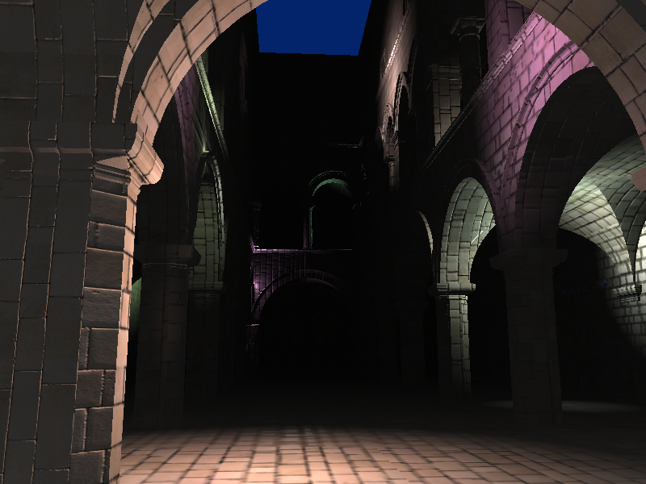
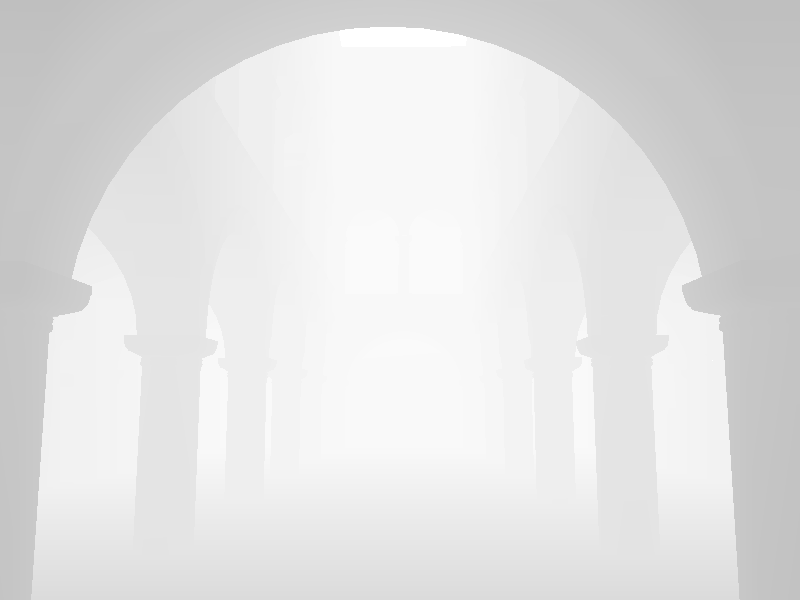
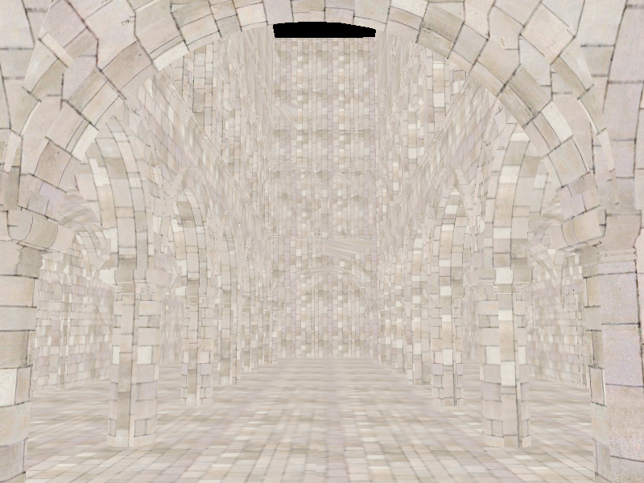
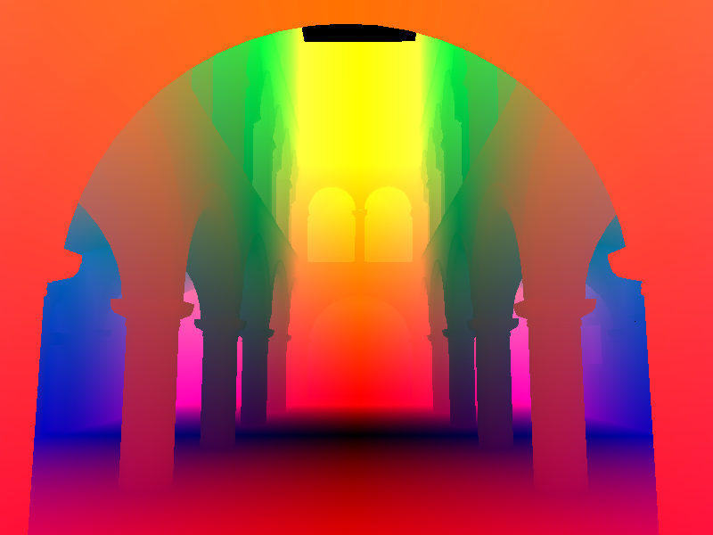
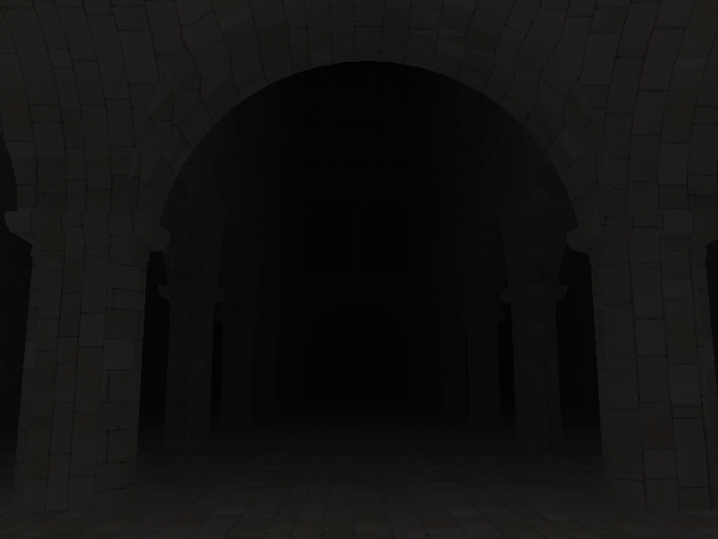
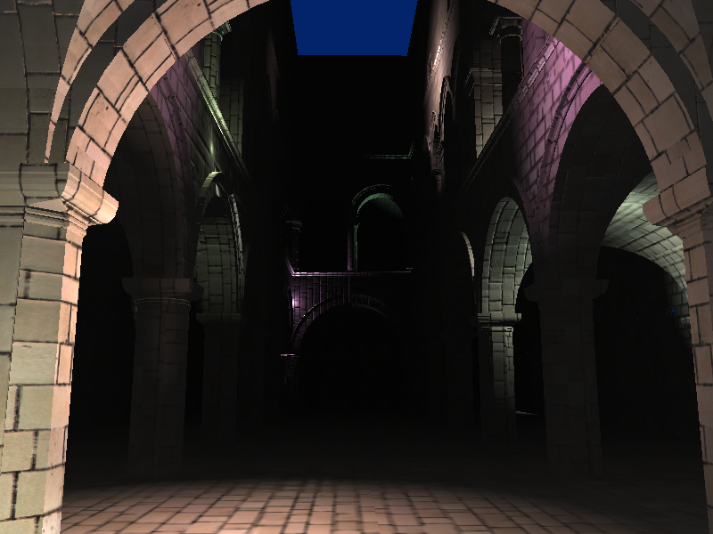
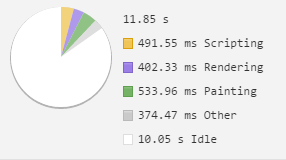
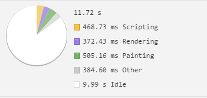

WebGL Deferred Shading
======================

**University of Pennsylvania, CIS 565: GPU Programming and Architecture, Project 6**

* Ziye
* Tested on: Google Chrome 41.0.2272.89 m on Windows 10, i7-4710MQ @ 2.50GHz 32GB, AMD HD8970M (Personal Laptop)

### Demo Video

##Progress
======================
###Debug View

Here I generate the simple debug view by visualize the data pass from the copy shader, which use different properties (depth, color, position, normal, etc.) as different texture to pass for later processing.

* Depth Map

* Color Map

* Position Map

* Normal Map

* Geometry Normal

* Surface Normal Map

### Lightning
* Ambient Light

I am using the global light with distance attenuation to generate the ambient light effect. As can be seen from the image below, the farther the distance, the darker it is.

* Bling Phong
 
For Bling Phong Lightning, I am using the standard method to compute the color on the surface. Also, in order to let each light influence a certain distance of area. I compare the distance from the surface to the position of the light, if it is beyond the influence region, I simply just ignore this light. Besides, I also introduce the attennuation of light according to the distance.

### Special Effects
* Bloom

For the Bloom Effect, I am using the Gaussian Blur to generate it. First I tried it with the standard 2D convolution, which is time comsuming and need to get more data. (O(m*n)) Then I tried the Two-pass Gaussian blur using separable convolution to improve the performance, this method has the complexity of O(m+n). If the m and n are very large, this improvement will be quite obvious.

* Toon

For the Toon Effect, I am using the simple 2 Tone method, which just compare the color with some threshold to get the final result. 

### Optimization
* Without G-Buffer Optimization (Rendering takes 22.3% valid time)

* With G-Buffer Optimization (Rendering takes 21.5% valid time)

Previously, I am using all the g-buffer to generate the result. This require a lot of data passing and can impact the performance. So I tried to reduce number of properties passed via g-buffer. Basically, I just applying the normal map in the copy shader pass instead of copying both geometry normals and normal maps.This improvement is kind of small according to the compare above.

*Scissor test

Using the getScissor code provided, I generate the debug view of Scissor test above. Although it is not very close bounded, we can already see that it reduce the amount of compute and render work by quite a lot.

